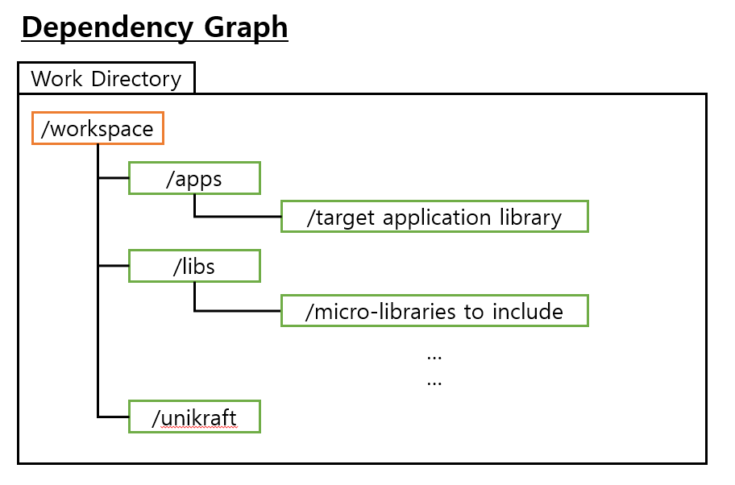

# Unikraft 빌드 및 실행 방법


## 빌드 방법

### 예제 ) Redis Application


### Dependency Graph



Redis Application에 필요한 Unikraft 기본 라이브러리
1. [lib-pthread-embedded](https://github.com/unikraft/lib-pthread-embedded.git)
2. lib-newlib
3. lib-lwip

### Makefile
```
UK_ROOT ?= $(PWD)/../../unikraft
UK_LIBS ?= $(PWD)/../../libs
LIBS := $(UK_LIBS)/lib-pthread-embedded:$(UK_LIBS)/lib-newlib:$(UK_LIBS)/lib-lwip:$(UK_LIBS)/lib-redis

all:
	@$(MAKE) -C $(UK_ROOT) A=$(PWD) L=$(LIBS)

$(MAKECMDGOALS):
	@$(MAKE) -C $(UK_ROOT) A=$(PWD) L=$(LIBS) $(MAKECMDGOALS)
```


기타 Unikraft Micro-Library들을 추가하고 싶을시 아래와 같이 Makefile의 `LIBS`에 디렉토리를 추가하면 됨

```
UK_ROOT ?= $(PWD)/../../unikraft
UK_LIBS ?= $(PWD)/../../libs
LIBS := $(UK_LIBS)/lib-pthread-embedded:$(UK_LIBS)/lib-newlib:$(UK_LIBS)/lib-lwip:$(UK_LIBS)/lib-tlsf:$(UK_LIBS)/lib-redis

all:
	@$(MAKE) -C $(UK_ROOT) A=$(PWD) L=$(LIBS)

$(MAKECMDGOALS):
	@$(MAKE) -C $(UK_ROOT) A=$(PWD) L=$(LIBS) $(MAKECMDGOALS)
```


File System
현재 Unikraft에서 지원하고 있는 File system(2022년 12월 기준)
[o] Initrd   Initrd

| Unikraft File System | Intel               | Raspi              |
| -------------------  | ------------------- | ------------------ |
| 9pfs                 | :heavy_check_mark:  | :heavy_check_mark: |
| initrd               | :heavy_check_mark:  | :x:                |


## 실행 방법

Server와 연결할 Bridge 추가

```
sudo brctl addbr br0
sudo ip a a 172.44.0.1/24 dev br0
sudo ip l set dev br0 up
```


QEMU + Unikraft Image 실행


```

```

```

```


참고자료: https://github.com/mariasfiraiala/scs-work/blob/master/unikraft-scs/unikraft-scs-for-complex-apps.md
