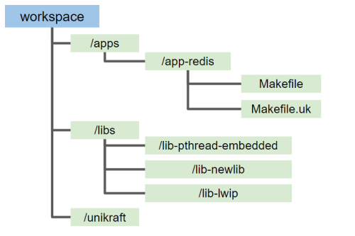

# Unikraft 빌드 및 실행 방법


### General Unikraft Workspace


## 빌드 방법
### 예제 ) Redis Application


### Redis Workspace


Unikraft 소스 코드
1. [Unikraft](https://github.com/unikraft/unikraft)

Redis Application에 필요한 Unikraft 기본 라이브러리
1. [lib-pthread-embedded](https://github.com/unikraft/lib-pthread-embedded.git)
2. [lib-newlib](https://github.com/unikraft/lib-newlib)
3. [lib-lwip](https://github.com/unikraft/lib-lwip)


Redis Application 실행 라이브러리
1. [redis](https://github.com/unikraft/lib-redis.git)


위의 실행 라이브러리들로 Redis Workspace 그림과 같이 배치


### app-redis 디렉토리에 다음과 같이 Makefile 생성

```
UK_ROOT ?= $(PWD)/../../unikraft
UK_LIBS ?= $(PWD)/../../libs
LIBS := $(UK_LIBS)/lib-pthread-embedded:$(UK_LIBS)/lib-newlib:$(UK_LIBS)/lib-lwip:$(UK_LIBS)/lib-redis

all:
	@$(MAKE) -C $(UK_ROOT) A=$(PWD) L=$(LIBS)

$(MAKECMDGOALS):
	@$(MAKE) -C $(UK_ROOT) A=$(PWD) L=$(LIBS) $(MAKECMDGOALS)
```


위의 library들 이외에 다른 Unikraft Micro-Library들을 추가하고 싶을시 아래와 같이 Makefile의 `LIBS`에 디렉토리를 추가하면 됨

```
UK_ROOT ?= $(PWD)/../../unikraft
UK_LIBS ?= $(PWD)/../../libs
LIBS := $(UK_LIBS)/lib-pthread-embedded:$(UK_LIBS)/lib-newlib:$(UK_LIBS)/lib-lwip:$(UK_LIBS)/lib-tlsf:$(UK_LIBS)/lib-redis

all:
	@$(MAKE) -C $(UK_ROOT) A=$(PWD) L=$(LIBS)

$(MAKECMDGOALS):
	@$(MAKE) -C $(UK_ROOT) A=$(PWD) L=$(LIBS) $(MAKECMDGOALS)
```


## 환경 설정


1. Architecture Selection
```
	- Arm based 환경 선택
		ex) Architecture(Armv8 compatible (64 bits)), Target proccessor(Auto-detect host CPU)
```

2. Platform Configuration
```
	- KVM 
```

3. Library Configuration

```
	- libredis
		: Provide main function 추가
	- lwip
		: ipv4, UDP support, TCP support, ICMP support, DHCP support, Socket API 추가
	- libnewlib
	- libpthread-embedded
	- vfscore
		: Default root file system 로 9pfs 를 사용하도록 설정 (아래 표와 같이 Arm 환경에서 9pfs 이외의 파일시스템은 지원 X)
```


### Unikraft에서 지원하고 있는 File system(2022년 12월 기준)

| Unikraft File System | Intel               | Raspi              |
| -------------------  | ------------------- | ------------------ |
| 9pfs                 | :heavy_check_mark:  | :heavy_check_mark: |
| initrd               | :heavy_check_mark:  | :x:                |


## 실행 방법

Server와 연결할 Bridge 추가

```
sudo brctl addbr br0
sudo ip a a 172.44.0.1/24 dev br0
sudo ip l set dev br0 up
```


QEMU + Unikraft Image 실행


Unikraft에서 제공하는 qemu emulator 실행 스크립트 [qemu-guest](https://github.com/unikraft/kraft/blob/staging/scripts/qemu-guest)
으로 실행

```
taskset -c 0 qemu-guest -t arm64v -k build/app-redis_kvm-arm64  \
-a "netdev.ipv4_addr=172.44.0.2 netdev.ipv4_gw_addr=172.44.0.1 netdev.ipv4_subnet_mask=255.255.255.0 -- /redis.conf" \
-m 1024 -b br0 -e $(pwd)/fs0

```


vhost 기능을 사용한 채로 실행 시 qemu-guest의 561줄 code 다음과 같이 변경

```
- QEMU_ARGS+=("tap,id=hnet${NICID},vhost=off,script=${TEMP}/ifup${NICID}.sh,downscript=${TEMP}/ifdown${NICID}.sh")
+ QEMU_ARGS+=("tap,id=hnet${NICID},vhost=on,script=${TEMP}/ifup${NICID}.sh,downscript=${TEMP}/ifdown${NICID}.sh")
```


## Trouble shooting

9pfs file system mount 에러 발생시 qemu-guest의 640줄 code line 다음과 같이 변경
```
- QEMU_ARGS+=("virtio-9p-pci,fsdev=hvirtio${VIRTIOID},mount_tag=fs${FSID}")
+ QEMU_ARGS+=("virtio-9p-pci,fsdev=hvirtio${VIRTIOID},mount_tag=rootfs")
```


KVM 사용 시 qemu-guest script를 다음과 같이 수정 (747줄)
```
- QEMU_BASE_ARGS+=("cortex-a53")
+ QEMU_BASE_ARGS+=("host")
```


참고자료: https://github.com/mariasfiraiala/scs-work/blob/master/unikraft-scs/unikraft-scs-for-complex-apps.md
